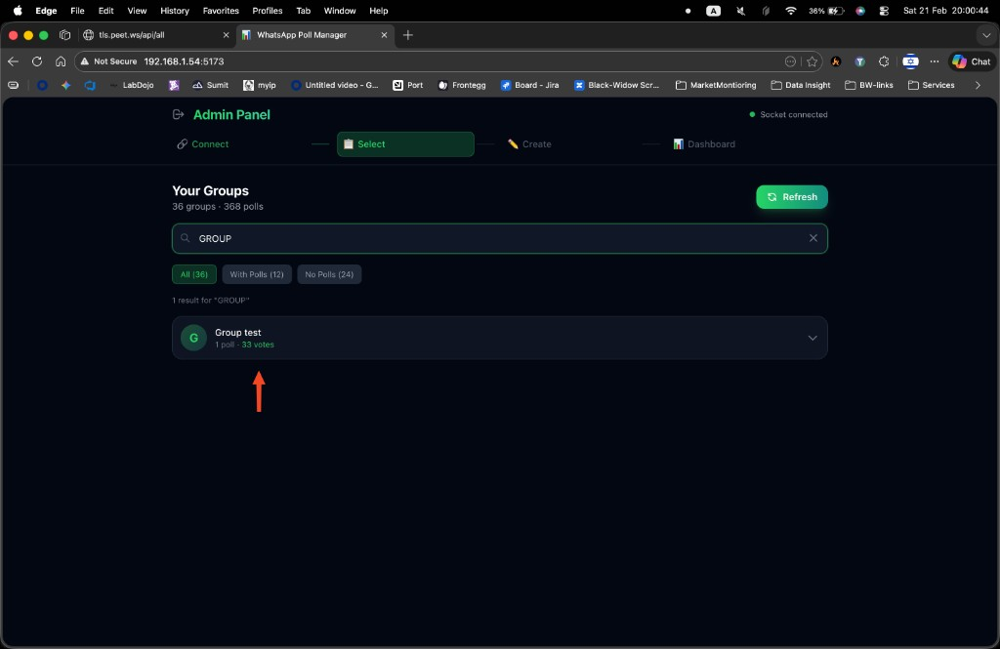
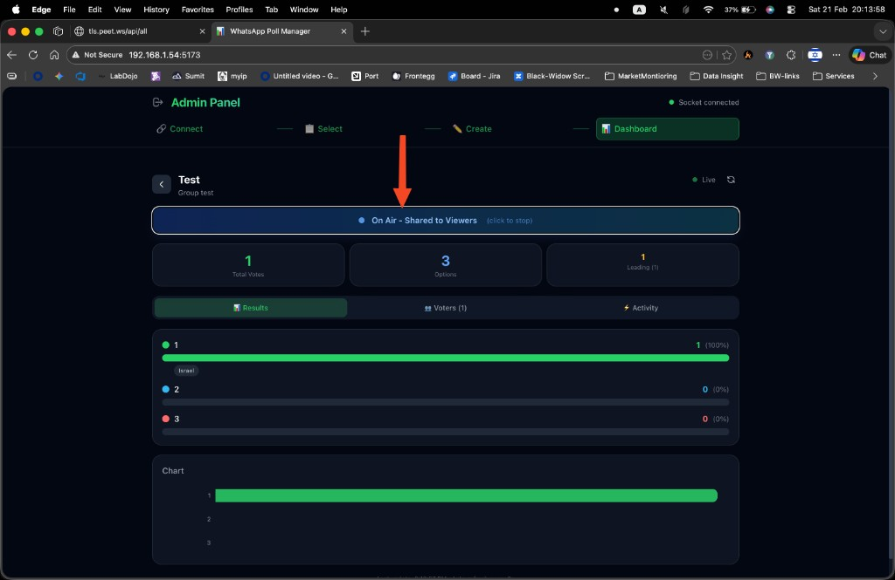
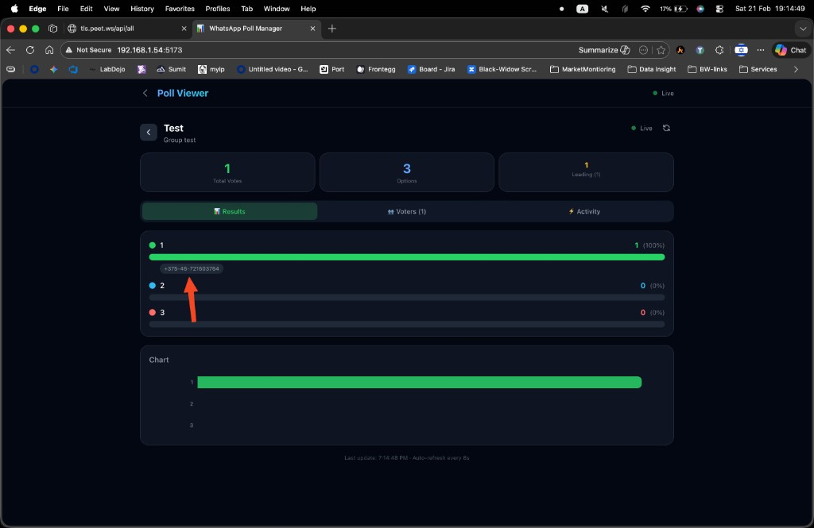

# WAPollView — Real-Time WhatsApp Poll Dashboard

Live polling dashboard that connects to WhatsApp, detects polls in your groups, decrypts votes in real time, and displays results on a beautiful web dashboard with 18 visualization templates.


## Features

- **One-Command Setup** — `docker compose up -d` and you're live
- **WhatsApp Integration** — Connects via QR code using multi-device protocol
- **Real-Time Votes** — Votes are decrypted and pushed to the dashboard instantly via WebSocket
- **18 Display Templates** — Classic bars, Pie, Radial, Podium, Battle VS, Gauge, Bubbles, Neon, Stadium, Waffle, Funnel, Emoji War + 4 animated templates (Pulse Wave, Slot Machine, Particles, Big Screen)
- **Admin / Viewer Modes** — Admin manages polls; Viewer shows shared results (great for projection)
- **Share to Viewer** — Broadcast a poll to the Viewer screen with one click
- **Voter Details** — Shows voter name and phone number on hover
- **Vote Notifications** — Full-screen animation with confetti when a new vote arrives
- **Session Persistence** — Mode survives page refresh until explicit logout

## Quick Start

### Prerequisites

- [Docker](https://docs.docker.com/get-docker/) installed (Docker Compose included)

### 1. Clone & Run

```bash
git clone https://github.com/il90il90/WAPollView.git
cd WAPollView
docker compose up -d
```

That's it. No `.env` file needed — everything works with sensible defaults.

### 2. Open the App

Go to **[http://localhost:5173](http://localhost:5173)**

### 3. Connect WhatsApp

1. Click **Admin** (top-right) → default password is `admin123`
2. Scan the **QR code** with WhatsApp (Settings → Linked Devices → Link a Device)
3. Done — your groups and polls appear automatically

## Optional Configuration

Create a `.env` file only if you want to customize:

```env
ADMIN_PASSWORD=your_password    # Default: admin123
FRONTEND_PORT=5173              # Web UI port
BACKEND_PORT=3002               # API port
POSTGRES_PASSWORD=your_db_pass  # Default: pollpass_secure_2024
```

<details>
<summary>All available variables</summary>

| Variable            | Default                  | Description              |
|---------------------|--------------------------|--------------------------|
| `ADMIN_PASSWORD`    | `admin123`               | Admin panel password     |
| `FRONTEND_PORT`     | `5173`                   | Web UI port              |
| `BACKEND_PORT`      | `3002`                   | Backend API port         |
| `POSTGRES_PORT`     | `5433`                   | PostgreSQL exposed port  |
| `POSTGRES_USER`     | `polluser`               | PostgreSQL username      |
| `POSTGRES_PASSWORD` | `pollpass_secure_2024`   | PostgreSQL password      |
| `POSTGRES_DB`       | `whatsapp_polls`         | PostgreSQL database name |

</details>

## Usage

### Admin Mode

1. Select a group that has polls
2. Open a poll to see the live dashboard
3. Pick a **display template** from the template row (14 regular + 4 animated)
4. Click **Share to Viewers** to broadcast to the Viewer screen





### Viewer Mode

1. Click **Enter as Viewer** on the main screen (no password)
2. The shared poll appears automatically with real-time updates
3. Perfect for projecting on a big screen — use the **Big Screen** animated template



## Display Templates

| Category | Templates |
|----------|-----------|
| **Charts** | Classic, Pie, Bars, Radial |
| **Competition** | Race, Podium, Battle VS, Emoji War |
| **Visual** | Gauge, Bubbles, Neon, Stadium, Waffle, Funnel |
| **Animated** | Pulse Wave, Slot Machine, Particles, Big Screen |

## Tech Stack

| Layer     | Technology                                |
|-----------|-------------------------------------------|
| Frontend  | React 19, Vite, TailwindCSS, Recharts     |
| Backend   | Node.js, Express, Socket.IO               |
| WhatsApp  | @whiskeysockets/baileys (multi-device)     |
| Database  | PostgreSQL 15, Prisma ORM                  |
| Infra     | Docker, Docker Compose, Nginx              |

## Project Structure

```
WAPollView/
├── backend/
│   ├── src/
│   │   ├── index.js          # Express + Socket.IO server
│   │   ├── whatsapp.js       # Baileys connection & vote processing
│   │   └── routes/api.js     # REST API endpoints
│   ├── prisma/schema.prisma  # Database schema
│   └── Dockerfile
├── frontend/
│   ├── src/
│   │   ├── App.jsx           # Main app with mode routing
│   │   └── components/       # Dashboard, templates, UI
│   ├── nginx.conf
│   └── Dockerfile
├── docker-compose.yml
├── .env.example
└── README.md
```

## Updating

```bash
git pull
docker compose up --build -d
```

## Troubleshooting

| Problem                      | Solution                                              |
|------------------------------|-------------------------------------------------------|
| QR code not showing          | `docker logs wapoll-backend-1`                        |
| WhatsApp disconnects         | Delete `auth_info/` folder and reconnect              |
| Votes not updating           | Ensure the poll was created while the bot was connected|
| Port already in use          | Set `FRONTEND_PORT` in `.env`                         |
| Reset everything             | `docker compose down -v` (deletes all data)           |

## License

MIT
